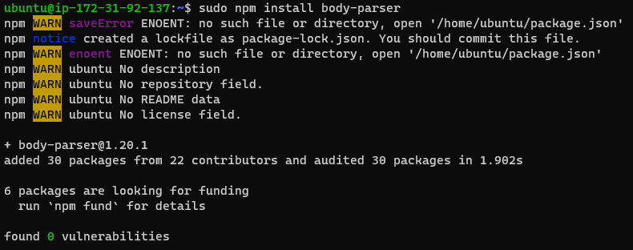
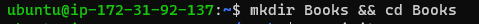
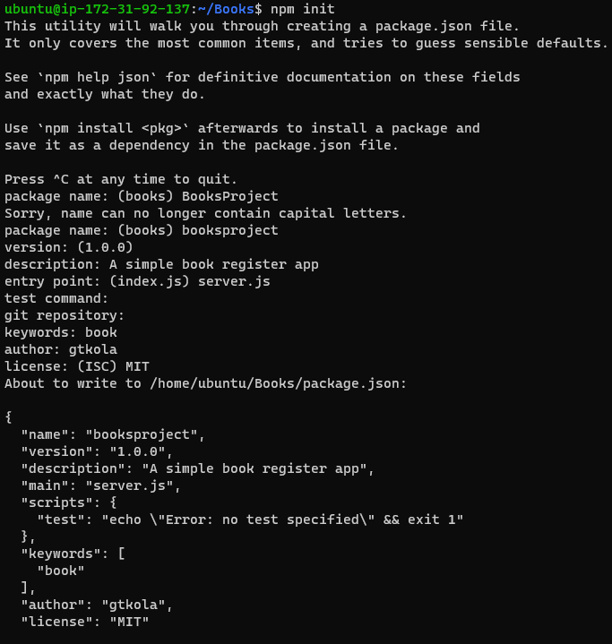

# MEAN STACK IMPLEMENTATION

## The task for this project is to implement a simple Book Register web form using MEAN stack

### STEP 1 - The first step after spinning my instance was to install NodeJS

 1. I updated and upgraded the server package

  `sudo apt update`

  

  `sudo apt upgrade`

  

 2. I then add certificates

  `sudo apt -y install curl dirmngr apt-transport-https lsb-release ca-certificates`

  `curl -sL https://deb.nodesource.com/setup_12.x | sudo -E bash -` 

  

 3. I installed Node.JS

  `sudo apt install -y nodejs`

  

### STEP 2- Install MongoDB

 4. Added key server

  `sudo apt-key adv --keyserver hkp://keyserver.ubuntu.com:80 --recv 0C49F3730359A14518585931BC711F9BA15703C6`

  `echo "deb [ arch=amd64 ] https://repo.mongodb.org/apt/ubuntu trusty/mongodb-org/3.4 multiverse" | sudo tee /etc/apt/sources.list.d/mongodb-org-3.4.list`

  

 5. I installed MongoDB
 
  `sudo apt install -y mongodb`

  

 6. Started MongoDB and verified service status

  `sudo service mongodb start`

  `sudo systemctl status mongodb`

  

 7. Installed npm

  `sudo apt install -y npm`

  

 8. Installed the body-parser package

  `sudo npm install body-parser`

  

 9. Created a new directory Books and changed pwd to Books

 `mkdir Books && cd Books`

 

 10. I initialized the project

  `npm init`

  

 11. Added a new file Server.JS

  `vi server.js`

  

### STEP 3-  Install Express and set up routes to the server

 12. Installed Express Mongoose

  `sudo npm install express mongoose`

 13. Created a new directory *apps* in the books directory and changed directory to *apps*

  `mkdir apps && cd apps`

 14. I then created a file names routes.js in the apps directory

  `vi routes.js`

  

 15. In the apps directory, I created another directory names *models* and changed directory to *models*

  `mkdir models && cd models` 
 
 16. I created a new file *book.js* in the models directory

  `vi book.js`

  

### STEP 4- Access the routes with AngularJS

 17. I changed directory back to the *Books* directory and a new directry called public

  `mkdir public && cd public`

 18. I then added a new file named scriptJs

  `vi script.js` 

  

 19.  In the *public* directory, i created a new file named index.html

  `vi index.html`

  

 20. I changed the directory back to *Books* and started the server

  `node server.js`

  

 21. I connected the server via port 3300 and verified the status

  `curl -s http://localhost:3300`

  

 22. Finally used my public IP address on port 3300 to view the web book register app

  
  
    
